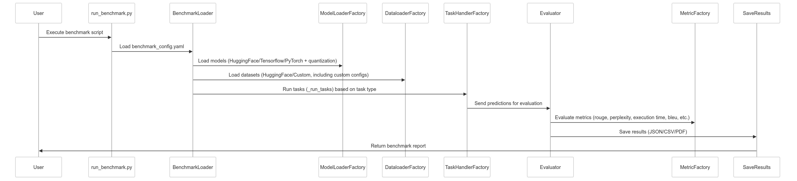

# Gemma Model Benchmark Suite

[](https://www.python.org/)

## Overview  
This framework offers a robust, automated solution to assess the performance of **Gemma models**, providing insights across diverse tasks including both academic benchmarks and custom datasets. The system emphasizes scalability, extensibility, and ease of use, ensuring researchers can efficiently measure and compare model performance.

---

## Modular Architecture

### Directory Structure
```bash
📦 src
├── 📂 config/                 
│   ├── benchmark_config.yaml   # Main benchmark configuration file
│   ├── logging.conf            # Logging configurations
│
├── 📂 benchmark/              # Core benchmarking logic and factories
│   ├── benchmark_loader.py     # BenchmarkLoader with run() and _run_tasks() methods
│   │
│   ├── 📂 models/             # Model management
│   │   ├── base_model_loader.py      # Abstract model interface
│   │   ├── concrete_models.py        # Loading from HuggingFace/TensorFlow/PyTorch
│   │   └── models_factory.py         # ModelLoaderFactory implementation
│   │
│   ├── 📂 datasets/           # Dataset handling
│   │   ├── base_dataset_loader.py    # Abstract dataset interface
│   │   ├── concrete_dataset_loader.py  # Implementations for Hub/S3/local
│   │   └── dataset_factory.py        # DataloaderFactory implementation
│   │
│   ├── 📂 tasks/              # Task-specific logic
│   │   ├── base_task_handler.py      # Abstract task interface
│   │   ├── concrete_task_handlers.py   # Handlers for generation/classification with batch sizing
│   │   └── task_handlers_factory.py   # TaskHandlerFactory implementation
│   │
│   ├── 📂 evaluation/         # Evaluation and metrics computation
│   │   ├── evaluator.py         # Evaluator logic to process predictions
│   │   └── 📂 metrics/          # Metrics computation
│   │       ├── base_metrics.py      # Abstract metric interface
│   │       ├── concrete_metrics.py  # Implementations of various metrics (rouge, perplexity, bleu, etc.)
│   │       └── metric_factory.py    # MetricFactory for orchestration
│   │
│   └── 📂 reporting/          # Reporting functionality
│       └── save_results.py    # SaveResults function to output reports (JSON/CSV/PDF)
│
├── 📂 scripts/                # Execution workflows
│   └── run_benchmark.py       # Main entry point that initializes BenchmarkLoader and starts the process
│
├── 📂 utils/                  # Shared utilities
│   └── logger.py              # Unified logging system
│
└── generate_default_config.py  # Utility to generate a default configuration file
```

---

## Quick Start

### 1. Clone Repository
```
git clone https://github.com/D0men1c0/DeepMind-GSoC-25-Benchmark-Gemma-Models
```
### 2. Installation Dependencies
```bash
pip install -r requirements.txt
```
### 3. Setup Envinronment
```bash
cd src
python -m venv venv
source venv/bin/activate  # Linux/Mac
venv\Scripts\activate
```
### 4. Run Benchmark
```bash
python scripts/run_benchmark.py \
    --config config/benchmark_config.yaml \
    --output-dir results/
```

---

## Workflow Deep Dive



### Benchmark Pipeline Overview

1. **Initialization & Configuration Loading**  
   - From `run_benchmark.py`, the benchmarking process begins by initializing the `BenchmarkLoader` and calling its `run()` method.
   - The `BenchmarkLoader` loads the `benchmark_config.yaml` configuration file. This file contains advanced settings (distributed training, multi-GPU, TPU usage), general experiment parameters (experiment name, output directory, random seed), model specifications, reporting preferences, and task definitions (including custom parameters like truncation, padding, max item generation, etc.).

2. **Model and Dataset Loading**  
   - **ModelLoaderFactory:**  
     The `BenchmarkLoader` calls the `ModelLoaderFactory` to load models from sources such as HuggingFace, TensorFlow, or PyTorch while applying the required quantization (e.g., 4bit).
   - **DataloaderFactory:**  
     Similarly, dataset parameters are sent to the `DataloaderFactory` to load datasets from HuggingFace or custom sources.

3. **Task Processing with _run_tasks**  
   - For each task defined in the configuration, the `BenchmarkLoader` invokes the `_run_tasks()` method.
   - This method processes the relevant dataset and then delegates to the `TaskHandlerFactory`, which determines whether the task is a generation or classification task and handles batch sizing accordingly.

4. **Evaluation & Metrics Calculation**  
   - The predictions generated by the task handlers are forwarded to the `Evaluator`.
   - The `Evaluator` uses the `MetricFactory` to compute evaluation metrics such as rouge, perplexity, execution time, bleu, etc.

5. **Reporting**  
   - Finally, the evaluation results are saved using the `SaveResults` function.
   - The final benchmark report is output in various formats (JSON, CSV, PDF) and returned to the caller.

### Summarize Components

| **Component**           | **Description**                                                                 | **Folder/Path**                   |
|-------------------------|---------------------------------------------------------------------------------|-----------------------------------|
| run_benchmark.py        | Main script that initializes the benchmarking process by creating and running the BenchmarkLoader | `src/scripts/`                        |
| BenchmarkLoader         | Loads the configuration file, models, and datasets; iterates over tasks by calling `_run_tasks()` | `src/benchmark/`|
| ModelLoaderFactory      | Factory for loading models from HuggingFace, TensorFlow, or PyTorch with quantization support | `src/benchmark/models/`               |
| DataloaderFactory       | Factory for loading datasets from HuggingFace and custom sources, including handling custom parameters | `src/benchmark/dataset/`             |
| TaskHandlerFactory      | Determines and dispatches tasks based on type (generation or classification with batch sizing) | `src/benchmark/tasks/`                |
| Evaluator               | Processes predictions and coordinates evaluation using various metrics         | `src/benchmark/evaluation/`           |
| MetricFactory           | Computes evaluation metrics (rouge, perplexity, execution time, bleu, etc.)        | `src/benchmark/evaluation/metrics/`   |
| SaveResults             | Saves final benchmark results in multiple formats (JSON, CSV, PDF)                | `src/benchmark/reporting/`            |

---

## Key Features

- **Advanced Configuration Management**  
  This system leverages a comprehensive YAML configuration file (`benchmark_config.yaml`) that enables users to specify advanced settings such as distributed training, multi-GPU/TPU utilization, and custom parameters (e.g., truncation, padding, max item generation). This flexible setup allows for fine-tuning experiments without changing the core code.

- **Comprehensive Evaluation & Reporting**  
  Combines classic NLP metrics with cutting-edge LLM evaluation ([2404.09135](https://arxiv.org/html/2404.09135v1)):  
  - **Core Metrics**: Accuracy, F1, BLEU, ROUGE  
  - **Advanced Generation**: BERTScore, BLEURT, Perplexity  
  - **Safety/Diversity**: Toxicity detection, Distinct-n, Entropy
  - **Composite Scoring**: Configurable weighted combinations

- **Modular & Scalable Architecture**  
  The architecture is designed around modular components with clear separations of concern. Factories such as `ModelLoaderFactory`, `DataloaderFactory`, `TaskHandlerFactory`, and `MetricFactory` abstract the implementation details, ensuring that new models, datasets, tasks, or metrics can be easily integrated. This pattern promotes scalability and long-term maintainability.

- **Multi-Framework Model Support**  
  The system supports loading models from HuggingFace, TensorFlow, and PyTorch. It also includes quantization support (e.g., 4bit) which is essential for optimizing resource usage and running benchmarks on various hardware configurations.

- **Flexible Dataset Integration**  
  Datasets can be loaded from both standard sources (like HuggingFace) and custom repositories. This flexibility makes it easier to benchmark against a diverse range of datasets, ensuring that experiments remain robust and applicable to multiple domains.

- **Task-Specific Processing**  
  Each benchmark task, whether it involves text generation or classification, is handled by specialized task handlers that manage processing nuances such as batch sizing. The design ensures that the system can cater to different types of NLP tasks while maintaining high performance.

- **Comprehensive Evaluation & Reporting**  
  The evaluator component orchestrates the calculation of various metrics (e.g., rouge, perplexity, execution time, bleu) through a dedicated MetricFactory. This comprehensive approach ensures that all aspects of model performance are measured. The final results are then saved in multiple formats (JSON, CSV, PDF), allowing for both automated post-processing and human review.

- **Factory Pattern Implementation**  
  By utilizing the factory design pattern throughout the system, I ensure a high level of abstraction and decoupling between components. This not only simplifies the process of extending the system with new functionality but also improves code readability and maintainability.

---

## Why Use This Benchmark Suite?  

- **Extensible Design** — Built with modular components and factory patterns to simplify future enhancements.  
- **Multi-Framework Support** — Compatible with **Hugging Face**, **TensorFlow**, and **PyTorch** models, including quantized versions for efficient evaluation.  
- **Advanced Evaluation Metrics** — Supports diverse metrics such as **accuracy**, **F1 score**, **perplexity**, **execution time**, and more.  
- **Flexible Task Management** — Handles both **classification** and **generation** tasks with dynamic batch sizing for optimal performance.  
- **Robust Reporting** — Produces results in multiple formats (**JSON**, **CSV**, **PDF**) and offers visual summaries for better insights.  

---

## Next Steps

- **Validation and Robust Testing**  
  - Conduct thorough unit and integration testing to validate each component of the system.
  - Perform end-to-end tests on the benchmark pipeline to ensure that configuration loading, model and dataset management, task handling, evaluation, and reporting work seamlessly together.
  
- **Expand Metrics Coverage**  
  - Integrate additional evaluation metrics to capture more nuanced aspects of model performance.
  - Consider metrics specific to new tasks or domains to broaden the benchmark’s applicability.

- **Enhance Task Handling for Generation**  
  - Refine the generation task handlers to improve output quality, reduce errors, and optimize batch processing.
  - Explore incorporating advanced techniques like beam search, temperature sampling, or top-k/top-p filtering to enhance generation capabilities.

- **Cloud Integration**  
  - Add support for cloud-based benchmarking
  - Implement distributed evaluation across multiple nodes  
  - Develop auto-scaling capabilities for large experiments  

- **Dashboard Integration**  
  - Develop an interactive dashboard to visualize benchmark results and system performance in real-time.
  - Consider integration with tools such as Grafana or building a custom web interface (like Streamlit) to allow users to drill down into metrics and track historical performance trends.

- **Database Integration**  
  - Implement a database layer to store benchmark results, configurations, and historical data for longitudinal studies.
  - Enable querying and reporting functionalities to support more in-depth analysis and decision-making based on past benchmark runs.

- **Continuous Improvement and Community Feedback**  
  - Set up a feedback loop with users and stakeholders to continuously refine the system based on real-world usage.
  - Encourage contributions from the community to add new features, support additional frameworks, and improve overall system performance.
