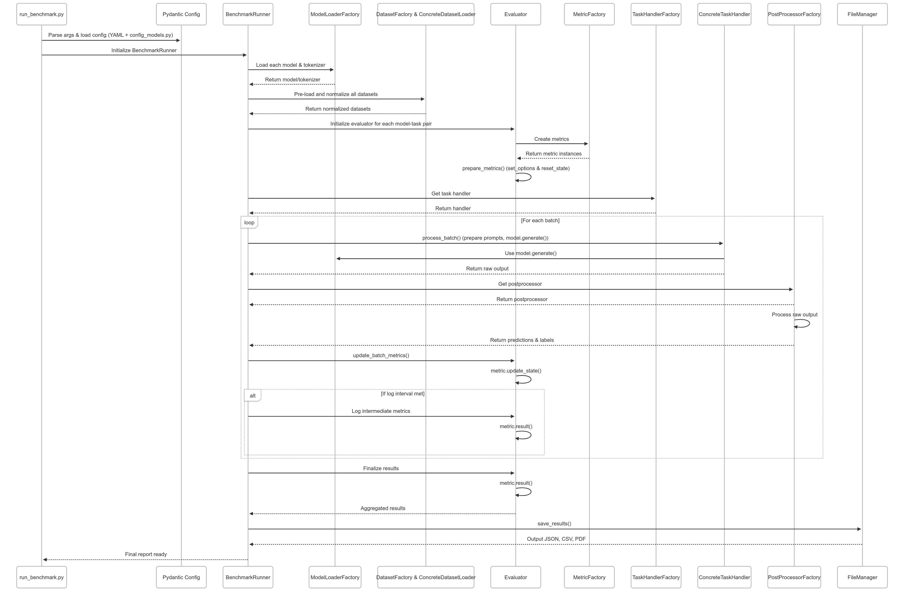

# Benchmark-Gemma-Models

[](https://www.python.org/)

## Overview
This framework offers a robust, automated, and scalable solution to assess the performance of Large Language Models (LLMs), with a primary focus on **Gemma models**. It provides insights across diverse tasks, including standard academic benchmarks and custom datasets. The system emphasizes scalability through efficient batch processing and stateful metrics, extensibility via a modular factory-based architecture, and ease of use, ensuring researchers can efficiently measure, compare, and reproduce model performance.

---

## Modular Architecture

The architecture is designed for clarity, maintainability, and extensibility. Key components are managed through factories, allowing for easy integration of new models, datasets, tasks, and metrics. Configuration is centralized using Pydantic models loaded from YAML files.

### Directory Structure
```bash
📦 src
├── 📂 config/
│   ├── benchmark_config.yaml         # Main Pydantic-driven benchmark configuration
│
├── 📂 benchmark/                    # Core benchmarking logic
│   ├── benchmark_loader.py           # Main BenchmarkRunner orchestrating the flow
│   │
│   ├── 📂 models/                   # Model loading and management
│   │   ├── base_model_loader.py      # Abstract model loader interface
│   │   ├── concrete_models.py        # Hugging Face, PyTorch, TensorFlow loaders
│   │   └── models_factory.py         # ModelLoaderFactory
│   │
│   ├── 📂 dataset/                   # Dataset loading and normalization (updated from 'datasets')
│   │   ├── base_dataset_loader.py     # Abstract dataset loader interface
│   │   ├── concrete_dataset_loader.py # Handles HF Hub, local, streaming, field normalization
│   │   └── dataset_factory.py         # DatasetFactory
│   │
│   ├── 📂 tasks/                     # Task-specific prompting and generation logic
│   │   ├── base_task_handler.py       # Abstract task handler interface
│   │   ├── concrete_task_handlers.py  # Handlers for various tasks (QA, Math, Summarization)
│   │   └── task_handlers_factory.py   # TaskHandlerFactory
│   │
│   ├── 📂 postprocessing/             # Task-specific output post-processing
│   │   ├── base_postprocessor.py       # Abstract post-processor interface
│   │   ├── concrete_postprocessors.py  # Implementations for MMLU, GSM8K, etc.
│   │   └── postprocessor_factory.py    # PostProcessorFactory
│   │
│   ├── 📂 evaluation/                 # Evaluation and metrics computation
│   │   ├── evaluator.py                # Evaluator managing stateful metrics lifecycle
│   │   └── 📂 metrics/                 # Metrics computation
│   │       ├── base_metrics.py         # Abstract stateful metric interface (reset, update, result)
│   │       ├── concrete_metrics.py     # Stateful implementations of various metrics
│   │       └── metric_factory.py       # MetricFactory
│   │
│   └── 📂 reporting/                 # Results saving and reporting
│       └── file_manager.py            # Saves results in JSON, CSV, PDF formats
│
├── 📂 scripts/                       # Execution entry points
│   └── run_benchmark.py               # Main script to run benchmarks
│
├── 📂 utils/                         # Shared utilities
│   └── logger.py                      # Unified logging system
│
├── config_models.py                  # Pydantic models for type-safe configuration
└── generate_default_config.py         # Utility to generate a default configuration file
```

---

## Quick Start

### 1. Clone Repository
```
git clone https://github.com/D0men1c0/Benchmark-Gemma-Models
```
### 2. Installation Dependencies
```bash
pip install -r requirements.txt
```
### 3. Setup Envinronment
```bash
cd src
python -m venv venv
source venv/bin/activate  # Linux/Mac
venv\Scripts\activate
```
### 4. Run Benchmark
```bash
python src/scripts/run_benchmark.py \
    --config src/config/benchmark_config.yaml \
    --output-dir results/
```

---

## Workflow Deep Dive



The benchmarking process is orchestrated by the `BenchmarkRunner` and initiated from the `run_benchmark.py` script.

1.  **Initialization and Configuration Loading**
    * The process begins when `run_benchmark.py` initializes the `BenchmarkRunner`.
    * A core part of this initialization is loading and validating the `benchmark_config.yaml` file using Pydantic models defined in `config_models.py` for type safety and clear structure.
    * This configuration file governs all aspects of the benchmark, including:
        * General experiment parameters (name, output directory, random seed).
        * Advanced runtime settings (multi-GPU usage, specific model generation parameters like truncation and padding).
        * Model details (including quantization choices).
        * Dataset sources and configurations.
        * Task definitions and their types.
        * Metric choices and their specific options.
        * Reporting preferences.

2.  **Dataset Sourcing and Preparation**
    * For each task outlined in the configuration, such as **MMLU (Anatomy subset)**, **GSM8K**, and **CNN/DailyMail Summarization**, the `BenchmarkRunner` ensures the respective datasets (`cais/mmlu`, `gsm8k`, `cnn_dailymail`) are available.
    * It employs a `DatasetFactory` to create instances of `ConcreteDatasetLoader`.
    * The `ConcreteDatasetLoader` is responsible for:
        * Fetching datasets from Hugging Face Hub, as specified (e.g., `cais/mmlu` with config `anatomy`, `gsm8k` with config `main`, `cnn_dailymail` with config `3.0.0`).
        * Supporting data streaming for large datasets.
        * Performing automatic field normalization, which intelligently maps diverse column names from original datasets (e.g., `question` and `answer` from GSM8K, or `article` and `highlights` from CNN/DailyMail) to a standardized set of field names (like `input_text`, `target_text`, `label_index`) based on the specified `task_type`. This standardization simplifies downstream processing by task handlers.

3.  **Model Loading and Setup**
    * For every model specified in the configuration (e.g., `gemma-7b`, `llama-2-7b`), the `BenchmarkRunner` utilizes a `ModelLoaderFactory`.
    * This factory instantiates the appropriate `ConcreteModelLoader`.
    * The `ConcreteModelLoader` then loads the target LLM from sources like Hugging Face, using the specified `checkpoint`.
    * The loading process also handles specified quantization (e.g., 4-bit, 8-bit) and model offloading to optimize resource usage.

4.  **Task Execution per Model and Dataset**
    * The `BenchmarkRunner` then iterates through each configured model and, for each model, through each defined task like **MMLU (Anatomy subset)**, **GSM8K**, or **CNN/DailyMail Summarization**.
    * For a given model-task pair:
        * A `TaskHandlerFactory` selects the specialized `ConcreteTaskHandler` based on the task's `type` (e.g., `multiple_choice_qa` for MMLU, `math_reasoning_generation` for GSM8K, `summarization` for CNN/DailyMail).
        * The `ConcreteTaskHandler` takes batches of data from the normalized dataset.
        * It prepares task-specific prompts tailored to guide the LLM effectively for that particular task (e.g., formatting MMLU questions with choices, passing GSM8K problems directly, or providing CNN/DailyMail articles for summarization).
        * It manages generation parameters (like `max_new_tokens`, `num_beams`) retrieved from the "advanced" section of the configuration.
        * The handler invokes the model's generation capabilities to get raw output.

5.  **Output Post-processing**
    * The raw text generated by the model often needs refinement before it can be evaluated.
    * A `PostProcessorFactory` selects a task-specific `ConcretePostProcessor`.
    * This component cleans the model's output and extracts the relevant information. For instance:
        * The `MMLUPostProcessor` extracts the choice letter (A, B, C, D) from the model's generation.
        * The `GSM8KPostProcessor` extracts the final numerical answer from the reasoned output.
        * The `SummarizationPostProcessor` might perform basic cleaning on the generated summary.
    * This step ensures that both predictions and reference labels are in a comparable format for metric calculation.

6.  **Stateful, Batched Evaluation**
    * The processed predictions and labels for each batch are then passed to an `Evaluator` instance.
    * The `Evaluator` manages the lifecycle of **stateful metrics**:
        * At the beginning of a task evaluation, it uses a `MetricFactory` to instantiate all configured `ConcreteMetric` classes (e.g., `exact_match` for MMLU and GSM8K; `rouge`, `bert_score` for summarization).
        * Each metric instance has its options set via its `set_options()` method (e.g., `normalize: true` for `exact_match`, or `lang: "en"` for `bert_score`) and its internal state reset via its `reset_state()` method.
    * As the `BenchmarkRunner` feeds data batch by batch, these are passed to the `evaluator.update_batch_metrics()` method. Each `ConcreteMetric` then updates its internal state based on the current batch's data.
    * To provide visibility during long runs, **intermediate metric scores** can be logged periodically, based on the `evaluation.log_interval` setting in the configuration.
    * Once all batches for a task have been processed, the `evaluator.finalize_results()` method is called. At this point, each `ConcreteMetric` computes its final score.

7.  **Reporting**
    * Finally, the `BenchmarkRunner` collects all aggregated metric results.
    * These comprehensive results are then passed to a `FileManager`, which saves them in the user-specified formats (e.g., JSON, CSV, PDF) to the designated output directory.

This structured pipeline ensures a reproducible, extensible, and efficient benchmarking process from configuration to final report.

### Core Components

| Component                 | Description                                                                                                                               | Path (`src/`)                         |
| :------------------------ | :---------------------------------------------------------------------------------------------------------------------------------------- | :------------------------------------ |
| `run_benchmark.py`        | Main script; parses arguments, loads the Pydantic-validated configuration, and initializes/runs the `BenchmarkRunner`.                      | `scripts/`                            |
| `config_models.py`        | Defines Pydantic models for structuring and validating `benchmark_config.yaml`.                                                           | `config_models.py`                    |
| `BenchmarkRunner`         | Orchestrates the entire benchmark lifecycle: dataset and model loading, iteration through tasks, and managing the evaluation flow.          | `benchmark/benchmark_loader.py`       |
| `DatasetFactory`          | A factory responsible for creating instances of `ConcreteDatasetLoader`.                                                                    | `benchmark/dataset/`                |
| `ConcreteDatasetLoader`   | Loads datasets from various sources (Hugging Face Hub, local), supports streaming, and performs crucial input field normalization.          | `benchmark/dataset/`                |
| `ModelLoaderFactory`      | A factory for creating model loader instances, supporting different frameworks and quantization.                                          | `benchmark/models/`                   |
| `TaskHandlerFactory`      | A factory that selects the appropriate `ConcreteTaskHandler` based on the `type` specified for a task.                                    | `benchmark/tasks/`                    |
| `ConcreteTaskHandler`     | Handles the specifics of a given task type, including preparing prompts/inputs from batched data and managing model generation.         | `benchmark/tasks/`                    |
| `PostProcessorFactory`    | A factory for selecting the appropriate `ConcretePostProcessor` for a task.                                                               | `benchmark/postprocessing/`           |
| `ConcretePostProcessor`   | Processes raw model outputs and reference labels to prepare them for consistent metric evaluation (e.g., extracting specific answer formats). | `benchmark/postprocessing/`           |
| `Evaluator`               | Manages the lifecycle of stateful metrics. It initializes metrics, updates them with data from each batch, and finalizes the results.       | `benchmark/evaluation/evaluator.py` |
| `MetricFactory`           | A factory used by the `Evaluator` to create instances of `ConcreteMetric` classes.                                                        | `benchmark/evaluation/metrics/`     |
| `ConcreteMetric`          | Implements specific evaluation metrics (e.g., Accuracy, ROUGE, ExactMatch) with a stateful interface (`set_options`, `reset_state`, `update_state`, `result`). | `benchmark/evaluation/metrics/`     |
| `FileManager`             | Responsible for saving the final, aggregated benchmark results into various output formats like JSON, CSV, and PDF.                       | `benchmark/reporting/file_manager.py` |

---

## Key Features

This benchmark suite is engineered from the ground up to provide a robust, flexible, and developer-friendly platform for comprehensive LLM evaluation:

* **Advanced, Pydantic-Driven Configuration:**
    * Utilizes a central YAML configuration file (`benchmark_config.yaml`), rigorously validated by Pydantic models (`config_models.py`).
    * Offers granular control over every experiment aspect:
        * **General Settings:** Experiment naming, output directories, random seeds.
        * **Model Parameters:** Specify LLMs (e.g., Gemma, Llama 2, Mistral), quantization (4-bit, 8-bit), offloading, and fine-tune generation arguments (`max_new_tokens`, `num_beams`, `temperature`, etc.).
        * **Dataset Specifications:** Define sources (Hugging Face Hub, local), splits, and streaming options.
        * **Task Definitions:** Configure multiple tasks (e.g., MMLU, GSM8K, Summarization) with their specific types.
        * **Metric Choices:** Select a wide array of metrics and their specific options (e.g., normalization for ExactMatch, language for BERTScore).
        * **Runtime Parameters:** Control `batch_size`, `truncation`, `padding`, and even settings for potential distributed training or specialized hardware (multi-GPU/TPU, though full support for these is a future step).
    * This centralized approach allows for complex experiment design and fine-tuning without altering the core codebase, ensuring reproducibility and ease of iteration.

* **Highly Modular & Scalable "Factory-First" Architecture:**
    * The entire framework is built upon a modular design leveraging the **factory pattern** for all core components: `ModelLoaderFactory`, `DatasetFactory`, `TaskHandlerFactory`, `PostProcessorFactory`, and `MetricFactory`.
    * This de-coupled architecture ensures **high extensibility and maintainability**. Adding new models, datasets, task types, post-processing routines, or evaluation metrics typically involves creating a new concrete class and registering it with the respective factory, minimizing impact on existing code.
    * This design inherently makes the suite **scalable**, ready to adapt as new LLMs and evaluation methodologies emerge.

* **Standardized Benchmarking Across Diverse LLMs:**
    * A key strength is the ability to benchmark **various LLMs on a consistent set of tasks and evaluation protocols**. By defining tasks (like MMLU, GSM8K, Summarization) and their evaluation criteria once in the configuration, you can systematically compare different models (Gemma, Llama, Mistral, etc.) and their variants (e.g., different sizes, quantization levels) under the same conditions.
    * This provides a level playing field for fair and insightful performance comparisons.

* **Automated Data Handling Pipeline:**
    * **Dataset Normalization:** `ConcreteDatasetLoader` automatically normalizes diverse dataset field names (e.g., mapping `article` or `question` to a standard `input_text`) based on `task_type`, simplifying data integration.
    * **Task-Specific Prompting:** `ConcreteTaskHandler` classes prepare tailored prompts from normalized batch data to guide LLMs effectively for each specific task.
    * **Output Post-processing:** Dedicated `ConcretePostProcessor` modules (e.g., `MMLUPostProcessor`, `GSM8KPostProcessor`) clean and structure raw model outputs (e.g., extracting choice letters, numerical answers), ensuring predictions are in a comparable format to reference labels for accurate evaluation.

* **Efficient & Scalable Evaluation with Stateful Metrics:**
    * **Stateful Metric Design:** Core evaluation metrics are implemented with a stateful interface (`set_options`, `reset_state`, `update_state`, `result`), allowing them to accumulate results batch-by-batch.
    * **Memory Efficiency:** This approach, managed by the `Evaluator`, drastically reduces memory footprint compared to loading all predictions/labels at once, enabling robust evaluation on very large datasets.
    * **Intermediate Progress Logging:** Monitor lengthy evaluations with periodic logging of current metric scores, configurable via `evaluation.log_interval`, providing valuable real-time feedback.

* **Comprehensive and Customizable Metric Suite:**
    * Supports a wide array of built-in metrics:
        * **Accuracy & Classification:** Accuracy, F1-Score, Precision, Recall.
        * **Text Generation & Similarity:** ROUGE, BERTScore, BLEU, METEOR, Perplexity.
        * **Exact Matching:** ExactMatch with configurable normalization.
        * **Diversity & Content:** Distinct N-grams, Word Entropy.
        * **And more**, all adapted for the stateful, batched flow.
    * Easily extendable with new custom metrics by adhering to the `BaseMetric` interface.

* **Versatile Reporting:**
    * The `FileManager` generates comprehensive benchmark results in multiple user-friendly formats: JSON (for machine readability), CSV (for data analysis in spreadsheets), and PDF (for shareable, human-readable reports).

---

## Why Use This Benchmark Suite?

Choose this suite for a robust, transparent, and developer-friendly LLM evaluation experience:

* **Scalability for Demanding Benchmarks:** Designed from the ground up with stateful metrics and batch processing to handle large datasets and complex models without exhausting memory.
* **Deep, Granular Insights:** Go beyond simple scores with task-specific input/output processing, a rich suite of diverse metrics, and detailed configuration options.
* **High Extensibility & Maintainability:** The modular, factory-based architecture makes it straightforward to add new models, datasets, evaluation tasks, or metrics as the LLM landscape evolves.
* **Reproducible & Configurable Experiments:** Pydantic-validated YAML configurations ensure that benchmarks are well-defined, easy to replicate, and simple to modify.
* **Efficient Resource Management:** Support for model quantization and careful batch handling helps optimize the use of computational resources.
* **Developer-Friendly:** Clear separation of concerns, Pythonic design, and comprehensive logging (including intermediate metrics) make the framework easy to understand, use, and debug.
* **Focus on Practicality:** Addresses real-world challenges in LLM benchmarking, such as efficient processing of large data and the need for diverse, task-appropriate evaluation.
* **Robust Reporting** Produces results in multiple formats (JSON, CSV, PDF) and offers visual summaries for better insights.

---

## Next Steps

Our immediate focus is on further solidifying the framework and enhancing its core benchmarking capabilities. Longer-term, we envision expanding its reach and analytical power, welcoming community contributions and feedback throughout the process.

### Immediate & Medium-Term Goals

* **Strengthen Test Coverage & Stability:**
    * Develop a comprehensive suite of unit and integration tests for key components (model/dataset loading, task handling, stateful metric evaluation, post-processing logic).
    * Conduct extensive end-to-end pipeline validation with diverse configurations and datasets to ensure robustness and reproducible results.
* **Expand Core Metrics & Benchmark Support:**
    * Integrate additional, widely-used evaluation metrics, particularly those capturing nuanced aspects of LLM performance such as advanced reasoning capabilities, instruction following fidelity, and specific safety or robustness probes.
    * Streamline the process for users to integrate new academic benchmarks and define custom task types within the existing factory-based architecture.
* **Enhance Generation Task Capabilities:**
    * Refine prompt engineering strategies within `TaskHandlers` to elicit optimal performance from different models.
    * Explore and integrate advanced, configurable generation techniques (e.g., beam search, diverse sampling methods like top-k/top-p, temperature control) as options within the `advanced` configuration section to allow for more controlled and varied model output during benchmarks.
* **Improve Reporting & Usability:**
    * Enhance the content, clarity, and visual appeal of generated PDF reports, potentially including more auto-generated charts summarizing key findings.
    * Refine existing documentation, create new tutorials or example use-cases, and ensure all README sections accurately reflect the latest features for an even smoother user experience.
* **Community Engagement & Continuous Feedback:**
    * Actively gather feedback from users and the broader AI/ML community to identify pain points, bugs, and desired features to guide future development.
    * Encourage and facilitate community contributions for new features, benchmarks, models, and metrics.

### Long-Term Vision / Ambitious Goals

* **Advanced Visualization & Interactive Analysis:**
    * Develop an interactive dashboard (e.g., using Streamlit or Gradio) for dynamic exploration, filtering, and comparison of benchmark results.
* **Simplified Cloud Execution & Scalability:**
    * Provide guidance, helper scripts, or investigate lightweight integrations for running benchmarks more easily on common cloud GPU platforms (e.g., Google Colab Pro, Kaggle Kernels, AWS SageMaker, GCP Vertex AI).
    * (Stretch) Explore options for distributed evaluation across multiple nodes for very large-scale experiments.
* **Database Integration for Longitudinal Studies:**
    * Implement an optional database backend (e.g., SQLite, PostgreSQL) to store, query, and analyze benchmark results over time, enabling tracking of model progress, regressions, and historical comparisons.
* **Broader Model & Framework Support:**
    * Continuously expand native support for new and emerging LLM architectures and model serving frameworks if community demand arises.

---
