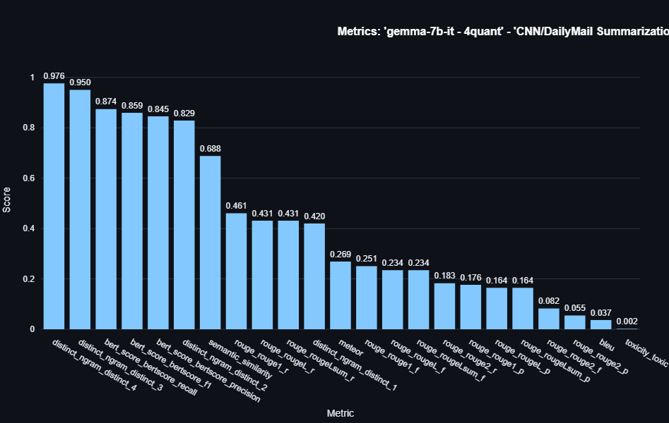

# Benchmark-Gemma-Models

[](https://www.python.org/)

## Table of Contents
- [Overview](#overview)
- [Modular Architecture](#modular-architecture)
  - [Directory Structure](#directory-structure)
- [Quick Start](#quick-start)
- [Examples & Getting Started](#examples--getting-started)
  - [Quick Test with Colab](#quick-test-with-colab)
  - [Generating a Default Configuration](#generating-a-default-configuration)
  - [Visualizing Benchmark Results](#visualizing-benchmark-results)
  - [Disclaimer on Experimental Results](#disclaimer-interpreting-experimental-results)
- [Configuring Benchmarks (`benchmark_config.yaml`)](#configuring-benchmarks-benchmark_configyaml)
- [Workflow Deep Dive](#workflow-deep-dive)
- [Core Components](#core-components)
- [Key Features](#key-features)
- [Why Use This Benchmark Suite?](#why-use-this-benchmark-suite)
- [Next Steps](#next-steps)
- [License and Important Disclaimers](#license-and-important-disclaimers)

## Overview
This framework offers a robust, automated, and scalable solution to assess the performance of Large Language Models (LLMs), with a primary focus on **Gemma models**. It provides insights across diverse tasks, including standard academic benchmarks and custom datasets. The system emphasizes scalability through efficient batch processing and stateful metrics, extensibility via a modular factory-based architecture, and ease of use, ensuring researchers can efficiently measure, compare, and reproduce model performance.

---

## Modular Architecture

The architecture is designed for clarity, maintainability, and extensibility. Key components are managed through factories, allowing for easy integration of new models, datasets, tasks, and metrics. Configuration is centralized using Pydantic models loaded from YAML files.

### Directory Structure
```bash
├── 📦 src /
│    ├── 📂 config/
│    │   ├── benchmark_config.yaml         # Main Pydantic-driven benchmark configuration
│    │
│    ├── 📂 benchmark/                    # Core benchmarking logic
│    │   ├── benchmark_loader.py           # Main BenchmarkRunner orchestrating the flow
│    │   │
│    │   ├── 📂 models/                   # Model loading and management
│    │   │   ├── base_model_loader.py      # Abstract model loader interface
│    │   │   ├── concrete_models.py        # Hugging Face, PyTorch, TensorFlow loaders
│    │   │   └── models_factory.py         # ModelLoaderFactory
│    │   │
│    │   ├── 📂 dataset/                   # Dataset loading and normalization (updated from 'datasets')
│    │   │   ├── base_dataset_loader.py     # Abstract dataset loader interface
│    │   │   ├── concrete_dataset_loader.py # Handles HF Hub, local, streaming, field normalization
│    │   │   └── dataset_factory.py         # DatasetFactory
│    │   │
│    │   ├── 📂 prompting/                 # Prompt engineering and building
│    │   │   ├── base_prompt_builder.py      # Abstract prompt builder interface
│    │   │   ├── concrete_prompt_builders.py # TemplateBased, MMLU, Translation builders etc.
│    │   │   └── prompt_builder_factory.py   # PromptBuilderFactory
│    │   │
│    │   ├── 📂 tasks/                     # Task-specific prompting and generation logic
│    │   │   ├── base_task_handler.py       # Abstract task handler interface
│    │   │   ├── concrete_task_handlers.py  # Handlers for various tasks (QA, Math, Summarization)
│    │   │   └── task_handlers_factory.py   # TaskHandlerFactory
│    │   │
│    │   ├── 📂 postprocessing/             # Task-specific output post-processing
│    │   │   ├── base_postprocessor.py       # Abstract post-processor interface
│    │   │   ├── concrete_postprocessors.py  # Implementations for MMLU, GSM8K, etc.
│    │   │   └── postprocessor_factory.py    # PostProcessorFactory
│    │   │
│    │   ├── 📂 evaluation/                 # Evaluation and metrics computation
│    │   │   ├── evaluator.py                # Evaluator managing stateful metrics lifecycle
│    │   │   └── 📂 metrics/                 # Metrics computation
│    │   │       ├── base_metrics.py         # Abstract stateful metric interface (reset, update, result)
│    │   │       ├── concrete_metrics.py     # Stateful implementations of various metrics
│    │   │       └── metric_factory.py       # MetricFactory
│    │   │
│    │   └── 📂 reporting/                 # Results saving and reporting
│    │       └── file_manager.py            # Saves results in JSON, CSV, PDF formats
│    │
│    ├── 📂 scripts/                       # Execution entry points
│    │   └── run_benchmark.py               # Main script to run benchmarks
│    │
│    ├── 📂 utils/                         # Shared utilities
│    │   └── logger.py                      # Unified logging system
│    │
│    ├── config_models.py                  # Pydantic models for type-safe configuration
│    └── generate_default_config.py         # Utility to generate a default configuration file
│
├── 📦 visualize/                          # Visualization scripts and dashboard
│   ├── dashboard.py                        # Streamlit dashboard application
│   ├── data_utils.py                       # Utilities for dashboard data processing
│   └── plotting_results.ipynb              # Jupyter notebook for plotting results
```

---

## Quick Start

### 1. Clone Repository
```
git clone https://github.com/D0men1c0/Benchmark-Gemma-Models
cd Benchmark-Gemma-Models
```
### 2. Installation Dependencies
```bash
pip install -r requirements.txt
```
### 3. Setup Environment
```bash
cd src
python -m venv venv
source venv/bin/activate  # Linux/Mac
venv\Scripts\activate
```
### 4. Run Benchmark
```bash
python src/scripts/run_benchmark.py \
    --config src/config/benchmark_config.yaml \
    --output-dir results/ \
    --log-to-file --log-file-dir run_logs/
```

---

## Examples & Getting Started

### Quick Test with Colab
A `hello_world.ipynb` notebook is provided at the root of the repository. It offers a simple way to clone the repository, install dependencies, and run a basic benchmark directly in a Google Colab environment. This is a great starting point for quickly testing the framework.

### Generating a Default Configuration
To get started with a base configuration, you can use the `generate_default_config.py` script located in the `src/` directory:

```bash
python src/generate_default_config.py
```

This will create a `default_benchmark_config.yaml` file in `src/config/` which you can then customize.

### Visualizing Benchmark Results
An interactive dashboard is available to explore the benchmark results.
1.  Ensure you have run a benchmark and results are saved (e.g., in `benchmarks_output/benchmark_results.json`).
2.  Run the Streamlit application:

```bash
streamlit run visualize/dashboard.py
```

This will launch the dashboard in your web browser. The `visualize/plotting_results.ipynb` notebook also contains examples of how benchmark data can be plotted programmatically.

Here's a sneak peek of the dashboard in action:

**Overall Dashboard Interface:**


**Example: MMLU Exact Match Comparison Across Models:**


**Example: Toxicity for a Specific Task:**


**Example: Metrics for a Specific Task (CNN/DailyMail with gemma-7b-it):**



**Example: Model vs Model Comparison (Gemma 2b vs Gemma 7b-it):**


### Disclaimer: Interpreting Experimental Results

The benchmark results presented through this dashboard, along with any accompanying graphs, are **experimental** and have **not been rigorously validated against official leaderboards**. This is primarily due to computational limitations, as testing has been conducted using freely available resources (e.g., Google Colab's free-tier T4 GPU). These results are intended for **illustrative and demonstrative purposes only**, showcasing the framework’s capabilities and offering a preliminary look at model performance under constrained conditions.

Please keep in mind the following factors related to these tests:

- **Restricted Data Subsets:** Evaluations are typically performed on a **small subset** of examples from each dataset (e.g., around **500 examples per task**, not the full validation/test sets which may include thousands of samples).
- **Quantized Models:** Models are often used in **quantized form** (e.g., 4-bit or 8-bit) to run on limited hardware.
- **Basic Prompting:** Prompting strategies are designed to be functional but are **not heavily optimized** for each model or task.
- **Generation Constraints:** Text generation is **capped** (e.g., 512 tokens for input, 150 for output) due to tokenizer and resource constraints.
- **Simplified Post-processing:** Output post-processing is basic and may lack the **robustness or nuance** of official benchmarks.
- **Hardware Limitations:** All benchmarks have been conducted using **a single T4 GPU on Google Colab Free Tier**.
- **Metric Implementations:** Metrics are computed using standard libraries (`scikit-learn`, `nltk`, `rouge-score`, `bert-score`, Hugging Face `evaluate`). Versions and parameters may differ from those used in official evaluations. Some metrics (e.g., Toxicity) rely on specific pretrained models within Hugging Face pipelines.

> **These results should not be taken as replacements for, or directly comparable to, official benchmark scores** published by model developers or evaluation organizations. They are meant to provide **preliminary insights** and to demonstrate the **modularity and flexibility** of the framework under resource-limited conditions.

---

## Configuring Benchmarks (`benchmark_config.yaml`)

All benchmark experiments are defined in a YAML configuration file (e.g., `src/config/benchmark_config.yaml`). This file details the models, tasks, datasets, metrics, and runtime settings. You can generate a full default configuration using `python src/generate_default_config.py`.

Here's a minimal example:

```yaml
general:
  experiment_name: "Gemma_Benchmark_Comprehensive_2025"
  output_dir: "./benchmarks_output"
  random_seed: 42

tasks:
  - name: "MMLU (all Subset - Templated)"
    type: "multiple_choice_qa"
    datasets:
      - name: "cais/mmlu"
        source_type: "hf_hub"
        config: "all"
        split: "validation"
        max_samples: 50
    handler_options:
      prompt_builder_type: "mmlu"
      prompt_template: # Prompt template can be defined here
    evaluation_metrics:
      - name: exact_match
        options: { normalize: true, ignore_case: true, ignore_punct: false }

models:
  - name: "gemma-2b"
    framework: "huggingface"
    checkpoint: "google/gemma-2b" # Or other models like phi-2, llama3
    quantization: "4bit"

model_parameters:
  max_input_length: 512 
  max_output_length: 512 

evaluation:
  log_interval: 5 

reporting:
  enabled: true
  format: "json"
  output_dir: "./reports"

advanced:
  batch_size: 10     
  truncation: true    
  padding: true       
  generate_max_length: 512 
  skip_special_tokens: true 
  max_new_tokens: 150
```

**Key sections briefly:**
* **`general`**: Experiment-wide settings.
* **`tasks`**: List of tasks. Each specifies its `type`, `datasets` (with `max_samples`), `handler_options` (like `prompt_builder_type` and optional `prompt_template`), and `evaluation_metrics`.
* **`models`**: List of models, detailing `checkpoint`, `quantization`, etc.
* **`evaluation`**: Settings for the evaluation process (e.g., `log_interval`).
* **`reporting`**: How to save results (e.g., `format`).
* **`advanced`**: Global parameters for tokenization and generation (e.g., `batch_size`, `max_new_tokens`).

**For the complete structure and all available options, please refer to `src/config/benchmark_config.yaml` or the file generated by `src/generate_default_config.py`.**

## Workflow Deep Dive


The benchmarking process is orchestrated by the `BenchmarkRunner` and initiated from the `run_benchmark.py` script.

1.  **Initialization and Configuration Loading**
    * The process begins when `run_benchmark.py` initializes the `BenchmarkRunner`.
    * A core part of this initialization is loading and validating the `benchmark_config.yaml` file using Pydantic models defined in `config_models.py` for type safety and clear structure.
    * This configuration file governs all aspects of the benchmark, including:
        * General experiment parameters (name, output directory, random seed).
        * Advanced runtime settings (multi-GPU usage, specific model generation parameters like truncation and padding).
        * Model details (including quantization choices).
        * Dataset sources and configurations.
        * Task definitions and their types (e.g., `multiple_choice_qa`, `math_reasoning_generation`, `summarization`, `translation`, `classification`, `text_pair_classification`).
        * Metric choices and their specific options.
        * Reporting preferences.

2.  **Dataset Sourcing and Preparation**
    * For each task outlined in the configuration, such as **MMLU (Anatomy subset)**, **GSM8K**, **CNN/DailyMail Summarization**, **OPUS-100 Translation**, **GLUE SST-2 Sentiment Classification**, and **GLUE MRPC Paraphrase Detection**, the `BenchmarkRunner` ensures the respective datasets are available.
    * It employs a `DatasetFactory` to create instances of `ConcreteDatasetLoader`.
    * The `ConcreteDatasetLoader` is responsible for:
        * Fetching datasets from Hugging Face Hub, as specified (e.g., `cais/mmlu` with config `anatomy`, `gsm8k` with config `main`, `cnn_dailymail` with config `3.0.0`, `opus100` with config `en-fr`, `glue` with config `sst2` or `mrpc`).
        * Supporting data streaming for large datasets.
        * Performing automatic field normalization, which intelligently maps diverse column names from original datasets to a standardized set of field names (like `input_text`, `target_text`, `label_index`) based on the specified `task_type`. This standardization simplifies downstream processing.

3.  **Model Loading and Setup**
    * For every model specified in the configuration (e.g., `gemma-7b`), the `BenchmarkRunner` utilizes a `ModelLoaderFactory`.
    * This factory instantiates the appropriate `ConcreteModelLoader`.
    * The `ConcreteModelLoader` then loads the target LLM from sources like Hugging Face, using the specified `checkpoint`.
    * The loading process also handles specified quantization (e.g., 4-bit, 8-bit) and model offloading to optimize resource usage.

4.  **Prompt Engineering and Task Execution per Model and Dataset**
    * The `BenchmarkRunner` then iterates through each configured model and, for each model, through each defined task.
    * For a given model-task pair:
        * The `ConcreteTaskHandler` (selected by `TaskHandlerFactory`) receives batches of data from the normalized dataset.
        * **Prompt Engineering:** Before passing data to the `TaskHandler` for execution, or as part of the `TaskHandler`'s initial setup for a batch, a `PromptBuilderFactory` selects a `ConcretePromptBuilder` (e.g., `MMLUPromptBuilder`, `TranslationPromptBuilder`, or a `TemplateBasedPromptBuilder`). This builder uses task-specific configurations and templates defined in `benchmark_config.yaml` (under `handler_options.prompt_template` and `handler_options.prompt_builder_type`) to construct the precise input prompts for the LLM. This allows for flexible and customizable prompt strategies for each task.
        * The `ConcreteTaskHandler` then uses these prepared prompts.
        * It manages generation parameters (like `max_new_tokens`, `num_beams`) retrieved from the "advanced" section of the configuration.
        * The handler invokes the model's generation capabilities (for generative tasks) or processes inputs (for classification tasks) to get raw output.

5.  **Output Post-processing**
    * The raw output generated/processed by the model often needs refinement.
    * A `PostProcessorFactory` selects a task-specific `ConcretePostProcessor`.
    * This component cleans the model's output and extracts the relevant information. For instance:
        * The `MMLUPostProcessor` extracts the choice letter (A, B, C, D).
        * The `GSM8KPostProcessor` extracts the final numerical answer.
        * Other post-processors ensure outputs are standardized for evaluation.
    * This step ensures that both predictions and reference labels are in a comparable format.

6.  **Stateful, Batched Evaluation**
    * The processed predictions and labels for each batch are passed to an `Evaluator` instance.
    * The `Evaluator` manages the lifecycle of **stateful metrics**:
        * It uses a `MetricFactory` to instantiate `ConcreteMetric` classes (e.g., `exact_match`, `rouge`, `bert_score`, `bleu`, `meteor`, `accuracy`, `f1_score`, `distinct_ngram`, and potentially others like `perplexity`, `toxicity`, `factual_consistency` if configured).
        * Each metric instance has its options set (e.g., `normalize: true` for `exact_match`, `lang: "en"` for `bert_score`) and its state reset.
    * As data is processed batch by batch, `evaluator.update_batch_metrics()` is called, and each `ConcreteMetric` updates its internal state.
    * Intermediate metric scores can be logged periodically.
    * Once all batches are processed, `evaluator.finalize_results()` computes the final scores.

7.  **Reporting**
    * Finally, the `BenchmarkRunner` collects all aggregated metric results.
    * These results are passed to a `FileManager`, saving them in user-specified formats (e.g., JSON, CSV, PDF).

This structured pipeline ensures a reproducible, extensible, and efficient benchmarking process from configuration to final report.

### Core Components

| Component                 | Description                                                                                                                               | Path (`src/`)                         |
| :------------------------ | :---------------------------------------------------------------------------------------------------------------------------------------- | :------------------------------------ |
| `run_benchmark.py`        | Main script; parses arguments, loads the Pydantic-validated configuration, and initializes/runs the `BenchmarkRunner`.                      | `scripts/`                            |
| `config_models.py`        | Defines Pydantic models for structuring and validating `benchmark_config.yaml`.                                                           | `config_models.py`                    |
| `BenchmarkRunner`         | Orchestrates the entire benchmark lifecycle: dataset and model loading, iteration through tasks, and managing the evaluation flow.          | `benchmark/benchmark_loader.py`       |
| `DatasetFactory`          | A factory responsible for creating instances of `ConcreteDatasetLoader`.                                                                    | `benchmark/dataset/`                |
| `ConcreteDatasetLoader`   | Loads datasets from various sources (Hugging Face Hub, local), supports streaming, and performs crucial input field normalization.          | `benchmark/dataset/`                |
| `ModelLoaderFactory`      | A factory for creating model loader instances, supporting different frameworks and quantization.                                          | `benchmark/models/`                   |
| `PromptBuilderFactory`    | A factory for selecting the appropriate `ConcretePromptBuilder` to construct task-specific prompts based on templates and configurations.   | `benchmark/prompting/`              |
| `ConcretePromptBuilder`   | Implements specific prompt building strategies (e.g., for MMLU, translation, or general template-based) using configured templates.         | `benchmark/prompting/`              |
| `TaskHandlerFactory`      | A factory that selects the appropriate `ConcreteTaskHandler` based on the `type` specified for a task.                                    | `benchmark/tasks/`                    |
| `ConcreteTaskHandler`     | Handles the specifics of a given task type, using prepared prompts, managing model interaction (generation/processing), and batching.     | `benchmark/tasks/`                    |
| `PostProcessorFactory`    | A factory for selecting the appropriate `ConcretePostProcessor` for a task.                                                               | `benchmark/postprocessing/`           |
| `ConcretePostProcessor`   | Processes raw model outputs and reference labels to prepare them for consistent metric evaluation (e.g., extracting specific answer formats). | `benchmark/postprocessing/`           |
| `Evaluator`               | Manages the lifecycle of stateful metrics. It initializes metrics, updates them with data from each batch, and finalizes the results.       | `benchmark/evaluation/evaluator.py` |
| `MetricFactory`           | A factory used by the `Evaluator` to create instances of `ConcreteMetric` classes.                                                        | `benchmark/evaluation/metrics/`     |
| `ConcreteMetric`          | Implements specific evaluation metrics (e.g., Accuracy, ROUGE, ExactMatch, BLEU, BERTScore) with a stateful interface.                    | `benchmark/evaluation/metrics/`     |
| `FileManager`             | Responsible for saving the final, aggregated benchmark results into various output formats like JSON, CSV, and PDF.                       | `benchmark/reporting/file_manager.py` |
| `generate_default_config.py`| Utility script to generate a boilerplate `benchmark_config.yaml` file with default settings. | `src/`                                |
| `dashboard.py`            | Streamlit application for interactive visualization of benchmark results.                                                                 | `visualize/`                          |
---

## Key Features

This benchmark suite is engineered from the ground up to provide a robust, flexible, and developer-friendly platform for comprehensive LLM evaluation:

* **Advanced, Pydantic-Driven Configuration:**
    * Utilizes a central YAML configuration file (`benchmark_config.yaml`), rigorously validated by Pydantic models (`config_models.py`).
    * Offers granular control over every experiment aspect:
        * **General Settings:** Experiment naming, output directories, random seeds.
        * **Model Parameters:** Specify LLMs (e.g., Gemma, Llama 2, Mistral), quantization (4-bit, 8-bit), offloading, and fine-tune generation arguments (`max_new_tokens`, `num_beams`, `temperature`, etc.).
        * **Dataset Specifications:** Define sources (Hugging Face Hub, local), splits, and streaming options.
        * **Task Definitions:** Configure multiple tasks (e.g., MMLU, GSM8K, **Summarization**, **Translation**, **GLUE tasks like SST-2, MRPC, STS-B**) with their specific types, and crucially, **customizable prompt templates and prompt builder types** via `handler_options`.
        * **Metric Choices:** Select a wide array of metrics and their specific options (e.g., normalization for ExactMatch, language for BERTScore, specific ROUGE types).
        * **Runtime Parameters:** Control `batch_size`, `truncation`, `padding`, and even settings for potential distributed training or specialized hardware (multi-GPU/TPU, though full support for these is a future step).
    * This centralized approach allows for complex experiment design and fine-tuning without altering the core codebase, ensuring reproducibility and ease of iteration.

* **Versatile Reporting & Visualization:**
    * The `FileManager` generates comprehensive benchmark results in multiple user-friendly formats: JSON (for machine readability), CSV (for data analysis in spreadsheets), and PDF (for shareable, human-readable reports).
    * An interactive **Streamlit dashboard** (`visualize/dashboard.py`) allows for dynamic exploration, filtering, and comparison of benchmark results.
    * The `visualize/plotting_results.ipynb` notebook provides further examples for programmatic result visualization.

* **Highly Modular & Scalable "Factory-First" Architecture:**
    * The entire framework is built upon a modular design leveraging the **factory pattern** for all core components: `ModelLoaderFactory`, `DatasetFactory`, `PromptBuilderFactory`, `TaskHandlerFactory`, `PostProcessorFactory`, and `MetricFactory`.
    * This de-coupled architecture ensures **high extensibility and maintainability**. Adding new models, datasets, **prompt strategies**, task types, post-processing routines, or evaluation metrics typically involves creating a new concrete class and registering it with the respective factory, minimizing impact on existing code.
    * This design inherently makes the suite **scalable**, ready to adapt as new LLMs and evaluation methodologies emerge.

* **Flexible Prompt Engineering:**
    * Dedicated `prompting` module with `BasePromptBuilder`, `ConcretePromptBuilder` implementations (e.g., `TemplateBasedPromptBuilder`, `MMLUPromptBuilder`, `TranslationPromptBuilder`), and a `PromptBuilderFactory`.
    * Allows users to define custom **prompt templates** directly in the `benchmark_config.yaml` for each task (via `handler_options.prompt_template`).
    * Supports selection of different **prompt building strategies** (`handler_options.prompt_builder_type`) for varied and sophisticated model interaction across all tasks, including **Summarization** and **Translation**.

* **Standardized Benchmarking Across Diverse LLMs & Expanded Task Suite:**
    * A key strength is the ability to benchmark **various LLMs on a consistent and expanded set of tasks and evaluation protocols**. By defining tasks (like MMLU, GSM8K, **Summarization**, **Translation**, Sentiment Analysis, Paraphrase Detection) and their evaluation criteria once in the configuration, you can systematically compare different models (Gemma, Llama, Mistral, etc.) and their variants.
    * This provides a level playing field for fair and insightful performance comparisons.

* **Automated Data Handling Pipeline:**
    * **Dataset Normalization:** `ConcreteDatasetLoader` automatically normalizes diverse dataset field names based on `task_type`, simplifying data integration.
    * **Task-Specific Prompting (via Prompt Builders):** `ConcretePromptBuilder` classes, selected via `PromptBuilderFactory`, prepare tailored prompts from normalized batch data and user-defined templates to guide LLMs effectively for each specific task, including nuanced instructions for **Summarization** or language pairs for **Translation**.
    * **Output Post-processing:** Dedicated `ConcretePostProcessor` modules (e.g., `MMLUPostProcessor`, `GSM8KPostProcessor`, `SummarizationPostProcessor`, `TranslationPostProcessor`) clean and structure raw model outputs, ensuring predictions are in a comparable format to reference labels for accurate evaluation.

* **Efficient & Scalable Evaluation with Stateful Metrics:**
    * **Stateful Metric Design:** Core evaluation metrics are implemented with a stateful interface (`set_options`, `reset_state`, `update_state`, `result`), allowing them to accumulate results batch-by-batch.
    * **Memory Efficiency:** This approach, managed by the `Evaluator`, drastically reduces memory footprint compared to loading all predictions/labels at once, enabling robust evaluation on very large datasets.
    * **Intermediate Progress Logging:** Monitor lengthy evaluations with periodic logging of current metric scores, configurable via `evaluation.log_interval`, providing valuable real-time feedback.

* **Comprehensive and Customizable Metric Suite:**
    * Supports a wide array of built-in metrics:
        * **Accuracy & Classification:** Accuracy, F1-Score, Precision, Recall.
        * **Text Generation & Similarity:** ROUGE (for **Summarization**), BERTScore (for **Summarization** and **Translation**), BLEU (for **Translation**), METEOR (for **Translation**), Perplexity.
        * **Exact Matching:** ExactMatch with configurable normalization.
        * **Diversity & Content:** Distinct N-grams, Word Entropy.
        * **Task-Specific:** Metrics are chosen appropriately for each task type, ensuring relevant evaluation for MMLU, GSM8K, **Summarization**, **Translation**, and others.
        **Metrics via Hugging Face Pipelines:** Includes metrics like Toxicity and potentially others that leverage pre-trained models through `transformers.pipeline`.
        * **And more**, all adapted for the stateful, batched flow.
    * Easily extendable with new custom metrics by adhering to the `BaseMetric` interface.

* **Quick Configuration Setup:** Includes a `generate_default_config.py` script to quickly bootstrap a `benchmark_config.yaml` file with sensible defaults, making it easier to get started.

* **Versatile Reporting:**
    * The `FileManager` generates comprehensive benchmark results in multiple user-friendly formats: JSON (for machine readability), CSV (for data analysis in spreadsheets), and PDF (for shareable, human-readable reports).

---

## Why Use This Benchmark Suite?

Choose this suite for a robust, transparent, and developer-friendly LLM evaluation experience:

* **Scalability for Demanding Benchmarks:** Designed from the ground up with stateful metrics and batch processing to handle large datasets and complex models without exhausting memory.
* **Deep, Granular Insights:** Go beyond simple scores with task-specific input/output processing (including **customizable prompt engineering via configuration** for nuanced model interaction), a rich suite of diverse metrics, and detailed configuration options that allow for fine-tuned experimentation across tasks like **Summarization**, **Translation**, and more.
* **High Extensibility & Maintainability:** The modular, factory-based architecture (now including a dedicated **PromptBuilderFactory**) makes it straightforward to add new models, datasets, **prompt strategies**, evaluation tasks, or metrics as the LLM landscape evolves.
* **Reproducible & Configurable Experiments:** Pydantic-validated YAML configurations, which can now also define **specific prompt templates per task**, ensure that benchmarks are well-defined, easy to replicate, and simple to modify for targeted investigations.
* **Efficient Resource Management:** Support for model quantization and careful batch handling helps optimize the use of computational resources.
* **Developer-Friendly:** Clear separation of concerns (with distinct modules for **prompting**, task handling, evaluation, etc.), Pythonic design, and comprehensive logging (including intermediate metrics) make the framework easy to understand, use, and debug.
* **Focus on Practicality:** Addresses real-world challenges in LLM benchmarking, such as efficient processing of large data, the need for diverse, task-appropriate evaluation (across a wider range of tasks including **Summarization** and **Translation**), and flexible model prompting.
* **Robust Reporting:** Produces results in multiple formats (JSON, CSV, PDF) and offers the potential for visual summaries for better insights.

---

## Next Steps

Our immediate focus is on further solidifying the framework and enhancing its core benchmarking capabilities. Longer-term, we envision expanding its reach and analytical power, welcoming community contributions and feedback throughout the process.

### Immediate & Medium-Term Goals

* **Strengthen Test Coverage & Stability:**
    * Develop a comprehensive suite of unit and integration tests for key components (model/dataset loading, task handling, stateful metric evaluation, post-processing logic).
    * Conduct extensive end-to-end pipeline validation with diverse configurations and datasets to ensure robustness and reproducible results.
* **Expand Core Metrics & Benchmark Support:**
    * Integrate additional, widely-used evaluation metrics, particularly those capturing nuanced aspects of LLM performance such as advanced reasoning capabilities, instruction following fidelity, and specific safety or robustness probes.
    * Streamline the process for users to integrate new academic benchmarks and define custom task types within the existing factory-based architecture.
* **Enhance Generation Task Capabilities:**
    * Further enhance prompt engineering capabilities by extending the new prompting module (e.g., for dynamic few-shot example selection, complex template logic) to elicit optimal performance from different models.
    * Explore and integrate advanced, configurable generation techniques (e.g., beam search, diverse sampling methods like top-k/top-p, temperature control) as options within the `advanced` configuration section to allow for more controlled and varied model output during benchmarks.
* **Refine GLUE Task Prompts:** 
    * Iterate on and improve the prompt engineering for GLUE tasks to optimize model performance and ensure reliable output parsing.
* **Community Engagement & Continuous Feedback:**
    * Actively gather feedback from users and the broader AI/ML community to identify pain points, bugs, and desired features to guide future development.
    * Encourage and facilitate community contributions for new features, benchmarks, models, and metrics.

### Long-Term Vision / Ambitious Goals
* **Advanced Visualization & Interactive Analysis:**
    * Further enhance the existing Streamlit dashboard with more advanced analytical features, such as detailed error analysis, longitudinal performance tracking (if a database backend is added), and more sophisticated comparative views.
* **Simplified Cloud Execution & Scalability:**
    * Provide guidance, helper scripts, or investigate lightweight integrations for running benchmarks more easily on common cloud GPU platforms (e.g., Google Colab Pro, Kaggle Kernels, AWS SageMaker, GCP Vertex AI).
    * (Stretch) Explore options for distributed evaluation across multiple nodes for very large-scale experiments.
* **Database Integration for Longitudinal Studies:**
    * Implement an optional database backend (e.g., SQLite, PostgreSQL) to store, query, and analyze benchmark results over time, enabling tracking of model progress, regressions, and historical comparisons.
* **Broader Model & Framework Support:**
    * Continuously expand native support for new and emerging LLM architectures and model serving frameworks if community demand arises.

---

## License and Important Disclaimers

**Project License:**

This project, Benchmark-Gemma-Models, is released under the **Apache 2.0 License**. You can find the full license text in the `LICENSE` file in the root of this repository.

**Nature of Benchmark Results:**

All benchmark results provided by or visualized through this framework are for **research, illustrative, and demonstrative purposes only.** They are generated under specific, resource-constrained conditions (often using quantized models, small data subsets, limited prompting, and basic post-processing on hardware like Google Colab's free T4 GPU tier) and **have not been rigorously validated against official leaderboards.**

* **No Guarantees:** The maintainers of this project are not responsible for any decisions made or actions taken based on these experimental results. Users are solely responsible for interpreting and using any outputs.
* **Experimental Data:** For a detailed understanding of the experimental conditions and limitations affecting the presented results, please see the "Important Disclaimer: Interpreting These Experimental Results" section [Disclaimer on Experimental Results](#disclaimer-interpreting-experimental-results) or refer to the notes accompanying any visualized data.

**Models Used and Third-Party License Compliance:**

This framework provides tools and scripts to evaluate third-party language models. It **does not distribute these models directly.** Users are responsible for obtaining access to these models and ensuring full compliance with their respective terms of use, licenses, and any applicable usage restrictions. Key model providers include, but are not limited to:

* **Google Gemma:** Subject to [Google Gemma Terms of Use](https://ai.google.dev/gemma/terms) and the [Gemma Prohibited Use Policy](https://ai.google.dev/gemma/prohibited_use_policy).
* **Mistral Models:** Subject to the terms provided by Mistral AI (e.g., [Mistral AI Technology](https://mistral.ai/terms#terms-of-service)).
* **Meta LLaMA Models:** Subject to the [Meta LLaMA License](https://ai.meta.com/llama/license/).
* **Any other models used in this framework** are subject to their respective licenses and terms, which users must review and comply with prior to use.

**No Affiliation or Endorsement:**

This project is an independent initiative and is not affiliated with, sponsored by, or endorsed by Google, Mistral AI, Meta Platforms, Inc., or any other third-party model provider. All product names, logos, and brands are property of their respective owners.

---